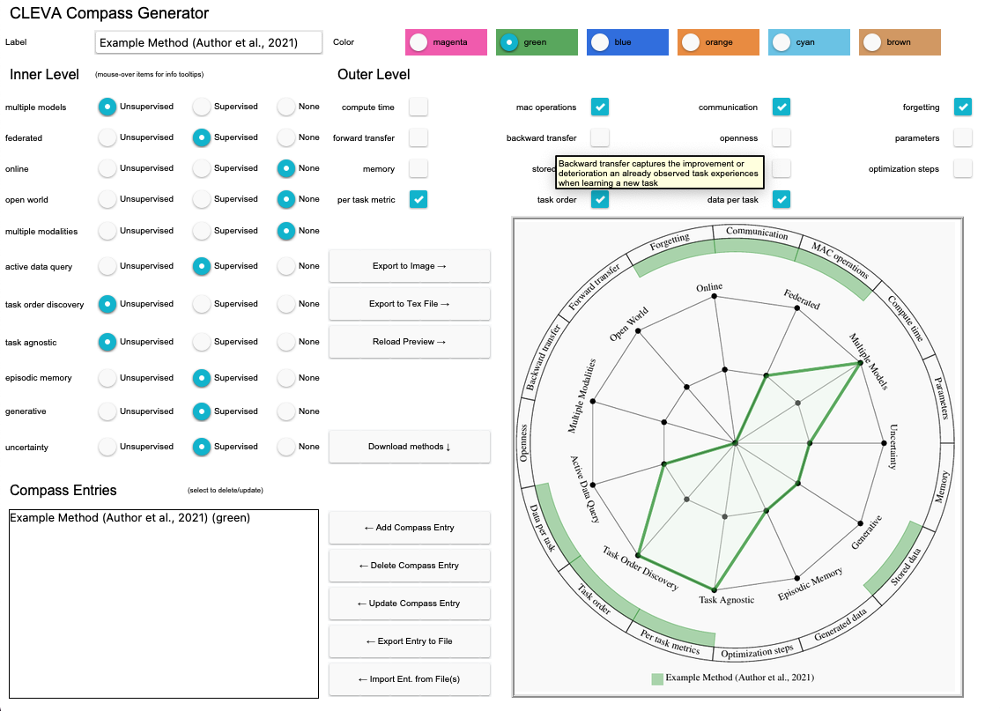
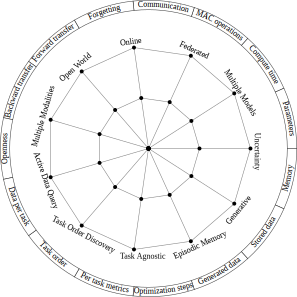
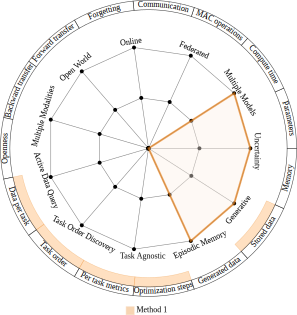
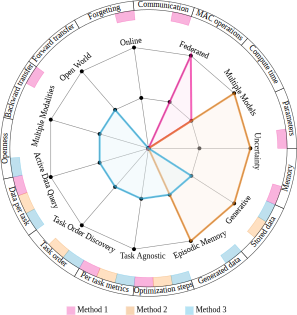

# The Continual Learning EValuation Assessment (CLEVA) Compass
This repository contains a template, code, and GUI to automatically generate the Continual Learning EValuation Assessment (CLEVA) Compass. 

The CLEVA-Compass provides the visual means to both identify how continual learning approaches are practically reported and how works can simultaneously be contextualized in the broader literature landscape. In addition to promoting compact specification in the spirit of recent replication trends, the CLEVA-Compass thus provides an intuitive chart to understand the priorities of individual systems, where they resemble each other, and what elements are missing towards a fair comparison. 

Please visit our paper for more details and include a reference if you make use of the CLEVA-Compass in your work:


> "CLEVA-Compass: A Continual Learning EValuation Assessment Compass to Promote Research Transparency and Comparability"; 
> Martin Mundt, Steven Lang, Quentin Delfosse, Kristian Kersting;
> International Conference on Learning Representations (ICLR) 2022;
> https://arxiv.org/abs/2110.03331 

## Usage options

To make the CLEVA-Compass as accessible as possible and disseminate in a convenient way, we provide three options for practical use. 

1. We provide a **LaTeX template** for the CLEVA-Compass, making use of the TikZ library to draw the compass within LaTeX. We envision that such a template makes it easy for other authors to include a compass into their future submission, where they can adapt the naming and values of the entries respectively.
2. We further provide a **Python script** to generate the CLEVA-Compass. In fact, because the use of drawing in LaTeX with TikZ may be unintuitive for some, we have written a Python script that automatically fills the above LaTeX template, so that it can later simply be included into a LaTeX document. The Python script takes a path to a JSON file that needs to be filled by the user with the CLEVA-Compass options. We further provide a default JSON file that is easy to adapt.
3. To further lower the barrier for dissemination and use, we also provide a **CLEVA-Compass Graphical User Interface (GUI)**. The GUI makes it easy for users to simply "click together" their desired compasses, save images or export to LaTeX, and conversely import already existing compass 

## Create the CLEVA-Compass using the GUI

<p align="center">
 
</p>

The CLEVA-Compass GUI can be run using Python: `python cleva_gui.py`. The application requires at least `TkInter` to be installed (Ubuntu: `apt install python3-tk`, Fedora: `dnf install python3-tkinter`, Arch Linux: `pacman -S tk`, MacOS: `brew install python-tk`). For the interactive visualization of the CLEVA-Compass, the system-wide [Poppler](https://poppler.freedesktop.org/) library is necessary (Ubuntu: `apt install poppler-utils`, Fedora: `dnf install poppler`, Arch Linux: `pacman -S poppler`, MacOS: `brew install poppler`) as well as a few additional Python dependencies are required (see [`gui_requirements.txt`](./gui_requirements.txt), install with `pip install -r gui_requirements.txt`). 

The GUI exposes tooltips on mouse-hover to display information on button actions and inner/outer level options. The main idea is that users create their own CLEVA-Compass visualization by interactively generating entries for specific methods. The list of current entries is shown on the bottom right in the GUI. A method entry consists of a unique label, a selected color, and inner/outer level options. If all is set, the `Add Compass Entry` button can be pressed and the entry will be listed below. Entries can be deleted when selected with the `Delete Compass Entry` button. A selected entry can also be change and its updated options stored when the `Update Compass Entry` button is pressed. The Compass preview can be generated explicitly, based on the current set of entries, using the `Reload Preview` button. Furthermore, entries can be imported (`Import Ent. from File(s)`) and exported (`Export Entry to File`) as a JSON file for serialization purposes, as well as SVG/PNG images (`Export to Image`) or as TikZ LaTeX code (`Export to Tex File`) which can be readily included into LaTeX documents.


## Create the CLEVA-Compass using the Python Script

You can use the `create_compass.py` python script to generate a compass and specify how it is filled for each continual approach in a JSON file:

``` sh
$ python create_compass.py -h
usage: create_compass.py [-h] [--template TEMPLATE] [--output OUTPUT] [--data DATA]

CLEVA-Compass Generator.

optional arguments:
  -h, --help           show this help message and exit
  --template TEMPLATE  Tikz template file. (default: cleva_template.tex)
  --output OUTPUT      Tikz filled output file. (default: cleva_filled.tex)
  --data DATA          Entries as JSON file. (default: data.json)
```

For this purpose we provide the template file `cleva_template.tex`.


### Example Usage
The default reads the template file from `cleva_template.tex` and writes the filled output file into `cleva_filled.tex` with the data specified via `--data <JSON_FILE>`:

``` sh
$ python --data examples/compass_data_0.json
```

An "empty" CLEVA-Compass, generated with [`examples/compass_data_0.json`](./examples/compass_data_0.json), looks like this:

<p align="center">
 
</p>

In the next section, we specify how to add methods to the json file to fill the compass.

### JSON Data Format

The JSON file specifies a list of `entries`, where each element defines a `color`, `label` (can contain escaped TeX commands, such as citations), `inner_level`, and `outer_level`. The latter two specify the attributes visualized in the compass. 

- `color`: Can be one of `["magenta", "green", "blue", "orange", "cyan", "brown"]`.
- `label`: A label describing the compass entry (can contain arbitrary, escaped TeX commands such as citations).
- `inner_level`: Specifies the inner compass level attributes. Attribute values must be on of:
    - `0`: does not apply
    - `1`: supervised
    - `2`: unsupervised
- `outer_level`: Specifies the outer compass level attributes. Attribute values must boolean (`true`/`false`).

The [`compass_data_1.json`](./examples/compass_data_1.json) file is given as an example:
``` json
{
  "entries": [
    {
      "color": "magenta",
      "label": "FedWeIT",
      "inner_level": {
        "multiple_models": 1,
        "federated": 2,
        "online": 0,
        "open_world": 0,
        "multiple_modalities": 0,
        "active_data_query": 0,
        "task_order_discovery": 0,
        "task_agnostic": 0,
        "episodic_memory": 0,
        "generative": 0,
        "uncertainty": 0
      },
      "outer_level": {
        "compute_time": false,
        "mac_operations": false,
        "communication": true,
        "forgetting": true,
        "forward_transfer": false,
        "backward_transfer": true,
        "openness": false,
        "parameters": true,
        "memory": true,
        "stored_data": false,
        "generated_data": false,
        "optimization_steps": true,
        "per_task_metric": true,
        "task_order": false,
        "data_per_task": true
      }
    }
  ]
}
```

The resulting file `compass_filled.tex` can then be included into any LaTeX document, e.g.:

```tex
\begin{figure}
    \input{compass_filled.tex}
    \caption{CLEVA-Compass for methods Foo, Bar, and Baz.}
\end{figure}
```

With the above example, this results in the following visualization:

<p align="center">
 
</p>


A JSON file with multiple entries ([`examples/compass_data_3.json`](./examples/compass_data_3.json)) produces the following compass:

<p align="center">
 
</p>

If you want to directly modify a filled template without using the Python script described below, we also provide `cleva_filled.tex` as an example with three entries, which corresponds to the results of `python create_compass.py --data examples/compass_data_3.json`.

## Contribute to transparency in continual learning

The CLEVA-Compass GUI can synchronize (download) existing methods from the repository, both as a means to avoid needless replication of methods, but also as a way to aggregate existing techniques in an attempt to make the continual learning landscape more transparent. 

We believe this is a community effort and should not be steered by a single commitee (us). In that spirit, **we welcome contributions of json files for existing continual learning methods, so that prospective users of the CLEVA-Compass can have convenient rapid access to a growing amount of CLEVA-Compass visualizations**. Please feel free to start a pull request and add a json file for methods that are not yet present in this repository's `methods` directory. 


See also the following quoted paragraph from our paper's Appendix C: 

> **Loading and the CLEVA-Compass repository to accumulate methods**: The final not yet de- scribed element of the GUI are the Import Entry from File(s) and Download Methods buttons. The Import Entry from File(s) functionality serves the purpose to enable users to load already existing CLEVA-Compass visualizations, in the form of loading their methods’ JSON representations. As such, users will not have to replicate each and every method that has already been visualized in the CLEVA-Compass by hand. In addition to this, a list of existing methods, which at the point of writing this paper consists of the five methods of the main body, is provided in our public repository. By using the Download Methods button the GUI will automatically synchronize the up-to-date list of available methods and enable an interactive selection. Our vision is that prospective papers can contribute their own visualizations to this repository, so the amount of published methods and their CLEVA-Compass representations grows into a comprehensive repository. We strongly believe that this can help foster transparency in our community for prospective continual learning authors, but also in terms of creating a more straightforward overview of the set-up and evaluation practices of continual learning approaches for application engineers and practitioners. As a side note, we note that this attempt at cataloguing works and their “rolling” aggregation is separate from proposing prospective adaptation and extensions of the CLEVA-Compass (think of the example of including causality in our main body’s outlook). For such major content and functionality updates, we subjec- tively envision a “discrete release” model, where prospective changes are encouraged to first undergo further stages of peer review, before being finally included into a CLEVA-Compass repository up- date. Although this may initially appear to slow down adoption of new methods, we argue in favor of this approach to limit the risk of a fixed set of researchers and a tiny portion of the community controlling such fundamental changes that steer the course of continual learning." 